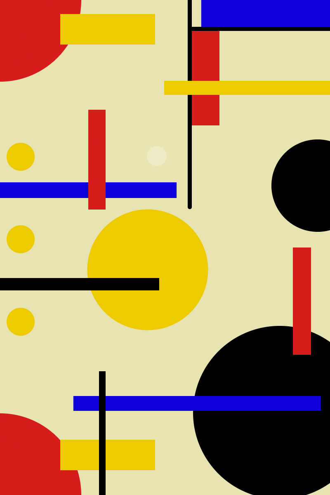

# Solemne-II
Entrega Solemne II pensamiento computacional

[link](https://editor.p5js.org/catalina.millan/sketches/0RHB242ux)

-ALumna: Catalina Millán
-inspirado en Bauhaus

-Aqui pueden observar un sistema visual dinámico e interactivo que genera composiciones geométricas
abstractas inspiradas en el Bauhaus. El proyecto no es una simple animación lineal,
sino un sistema generativo que procesa inputs continuos del usuario (posición
del mouse, clics, teclado) y los transforma en outputs visuales variables mediante
reglas computacionales claras. Cada interacción modifica parámetros que afectan
directamente la composición visual.
-El foco está en la interactividad continua: el usuario participa activamente
en la generación visual, transformando números (posiciones, frames, colores) en
una composición abstracta que evoluciona en tiempo real.

-**¿Qué se ve en pantalla?**

-Una composición geométrica de colores primarios (rojo, amarillo, azul y negro)
que ocupa toda la pantalla (400×600 píxeles). La composición está compuesta por
formas básicas (círculos, rectángulos, arcos, líneas) organizadas de manera
asimétrica pero equilibrada, similar al estilo de Piet Mondrian.
El fondo varía continuamente en brillo según la posición vertical del mouse,
creando un efecto de iluminación dinámica. Los elementos se transforman
permanentemente: algunos oscilan de lado a lado, otros cambian de tamaño,
y nuevos elementos aparecen cuando el usuario interactúa.
La pantalla nunca está "estática" - siempre hay movimiento, cambio y respuesta
a los inputs del usuario.

-**¿Qué elementos visuales aparecen?**
-Elementos fijos: Dos arcos rojos en las esquinas superior e inferior izquierda
Rectángulos de colores primarios en diferentes posiciones (rojo, amarillo, azul, negro)
Líneas negras que funcionan como ejes de referencia
Círculos en diversos tamaños (amarillo, negro, azul)

-Elementos dinámicos: Círculo amarillo central que varía de tamaño (80-220 píxeles)
Dos rectángulos azules que oscilan de lado a lado (movimiento sinusoidal)
Círculo azul que se desplaza horizontalmente continuamente
Fondo que varía en brillo (220-255)
Círculos aleatorios que aparecen cuando el usuario hace clic
Anillo blanco semi-transparente que sigue al mouse

-Elementos condicionales:

-En tema claro: elementos negros

-En tema oscuro: elementos blancos (inversión cromática)

-**¿Qué outputs genera?**

-Outputs visuales continuos: Variación de brillo del fondo (escala 220-255) en tiempo real
Cambio de tamaño del círculo central (escala 80-220 píxeles) suave y continuo
Movimiento sinusoidal de dos rectángulos azules (oscilar lado a lado)
Desplazamiento horizontal del círculo azul (bucle continuo)

-Outputs visuales discretos:Aparición de círculos aleatorios en posiciones y colores variables (por clic)
Anillo blanco seguidor del mouse (solo en mitad izquierda)
Transformación de color: elementos negros ↔ blancos (por tecla)

-Combinación:
La salida visual es una composición híbrida que combina: Determinismo sistemático (reglas matemáticas claras: sin(), map())
Aleatoriedad (random() para color y posición)
Interactividad (respuesta directa a inputs del usuario)

-**Idea central del proyecto**

-Traducir los principios fundamentales del Bauhaus a un sistema computacional
dinámico que responde continuamente a inputs del usuario. La idea explora la
tensión creativa entre orden y caos:

-Orden: Geometría clara, composición matemática, colores primarios limitados

-Caos: Interactividad del usuario, generación aleatoria, movimiento continuo

-El proyecto no busca crear "arte generativo aleatorio", sino demostrar cómo un
sistema de reglas claras (variables, condicionales, bucles, funciones) puede
producir una experiencia visual coherente que evoluciona en tiempo real.
Pregunta central que responde:
¿Cómo pueden principios de diseño histórico (Bauhaus) traducirse a lógica
computacional para crear sistemas interactivos?
